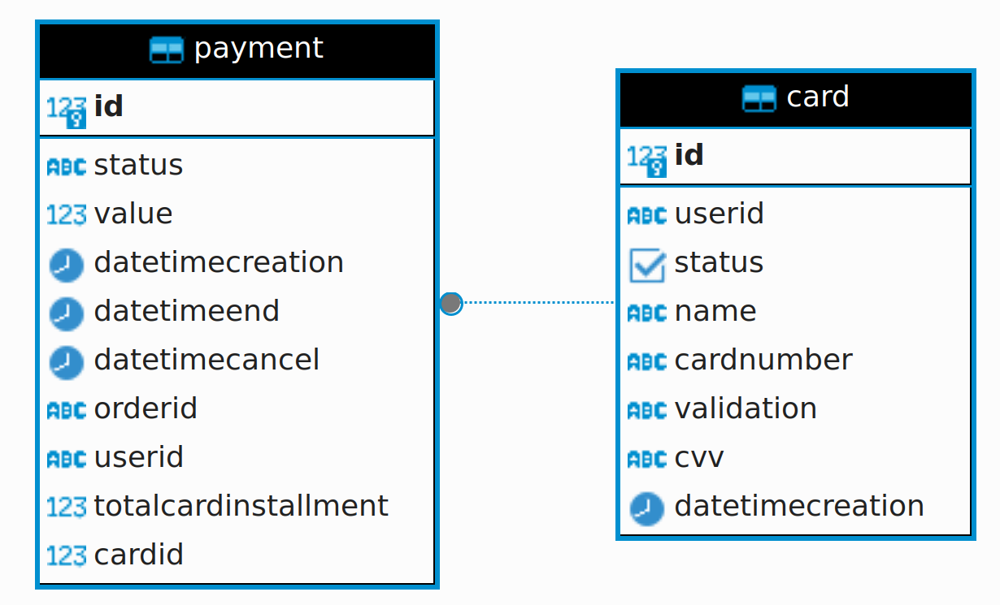

# API para Pagamento

Uma aplicação de manipulação de pagamentos.

## Operações
* Cadastro e exclusão lógica

## Pagamento
* Para registrar os pagamentos foi criado três entidades, sendo elas:
  * **Card**: Responsavel por registrar os dados de uma cartão de crédito.
  * **Payment**: Responsável por registrar os dados de um pagamento.
  * **PaymentItem**: Responsável por registrar os dados de um item de um pagamento.

